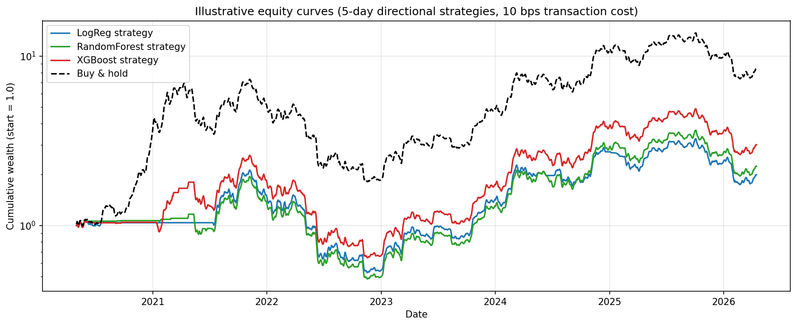
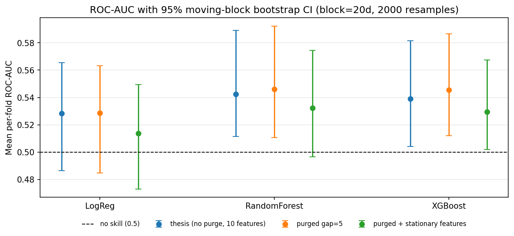

# Can classical ML time Bitcoin? An honest walk-forward study

[](https://github.com/MateuszJastrzebski21/btc-ml-pipeline/actions/workflows/tests.yml)

Predicting the direction of the 5-day BTC/USDT return from daily OHLCV data with
logistic regression, random forest and XGBoost, evaluated out-of-sample with
walk-forward validation, then stress-tested the way a sceptical reviewer would.

Engineering thesis, PJATK Warsaw, 2026 (supervisor: dr inż. Adam Szmigielski).
Full text (Polish): [`docs/thesis_PL.pdf`](docs/thesis_PL.pdf).

## TL;DR

- **The signal is weak but real for the tree models:** mean out-of-sample ROC-AUC is
  0.54 to 0.55. Its 95% block-bootstrap CI excludes 0.5 for RF/XGBoost and not for
  logistic regression.
- **It is not tradeable:** a long/flat strategy on the signal earns a Sharpe of 0.24 to 0.33
  after 10 bps costs, against 0.61 for buy-and-hold over the same 6 years.
- **Validation discipline mattered more than model choice:** hyperparameter tuning moved AUC by
  under 1 pp. Removing non-stationary features or getting the P&L accounting wrong moved the
  conclusions more than switching from logistic regression to XGBoost did.
- **Fully reproducible:** a frozen data window (2019-01-01 to 2026-04-25, 2,672 daily bars)
  reproduces every number in the thesis exactly. Look-ahead tests run in CI.

## Setup

| | |
|---|---|
| Data | Binance BTC/USDT daily bars, 2019-01-01 to 2026-04-25 (2,618 labelled rows, 54.1% up) |
| Target | `y_t = 1[close_{t+5} > close_t]` |
| Features | log return, momentum (5/10/20), realised vol (10/20), RSI-14, SMA-20/50 and their ratio |
| Validation | expanding-window walk-forward, 5 folds, 436 test days each (May 2020 to Apr 2026) |
| Models | persistence (1d, 5d), logistic regression, random forest, XGBoost; 21-config grid search |
| Extras | isotonic calibration, nested threshold selection, cost-aware backtest, per-regime breakdown, 3-class variant, MLflow tracking (~70 runs) |

## Results (thesis)

Mean over 5 walk-forward folds, threshold 0.5:

| Model | Accuracy | ROC-AUC | Log-loss |
|---|---|---|---|
| Persistence 1d | 0.473 | 0.471 | 2.43 |
| Persistence 5d | 0.485 | 0.479 | 2.38 |
| Logistic regression | 0.485 | 0.528 | 1.26 |
| Random forest | **0.500** | **0.543** | **0.72** |
| XGBoost | 0.499 | 0.539 | 1.00 |

Performance depends heavily on the regime. XGBoost reaches an AUC of 0.59 in the 2022 bear market
but performs at chance (0.48 to 0.50) in the 2020–21 bull run
([`regime_metrics.csv`](evaluation/results/regime_metrics.csv)).



## Post-thesis audit

After submitting the thesis I re-checked it against the objections a quant reviewer would raise
([`scripts/run_audit.py`](scripts/run_audit.py), outputs in [`evaluation/audit/`](evaluation/audit/)).
The thesis code was not changed, so its numbers still reproduce.

| Question | Finding |
|---|---|
| Does it beat *always predict up*? | **No, on accuracy and F1.** Always-up scores accuracy 0.536 and F1 0.70, beating every model on both, including the tuned F1 of 0.61–0.63 reported in the thesis. That F1 gain from threshold tuning mostly came from predicting "up" more often. Only ranking metrics (AUC) show skill. |
| Do the 5-day labels leak across the fold boundary? | **Negligibly.** Purging 5 rows (`TimeSeriesSplit(gap=5)`) moves AUC by less than 0.01. |
| Are raw price levels (`sma_20`, `sma_50`) a problem? | **Yes.** Without them, mean per-fold AUC drops to 0.51–0.53, while pooled AUC rises from ~0.50 to ~0.53. The level features shift the score scale from fold to fold. |
| Is AUC > 0.5 significant? | **Marginal.** 20-day moving-block bootstrap: RF 0.546 [0.511, 0.592], XGB 0.546 [0.512, 0.587], LogReg 0.529 [0.485, 0.563]. These p-values are not corrected for the 21-config search. |
| Is the backtest right? | **It was too generous.** The thesis spread each 5-day forward return over 5 days, used `sqrt(252)` for a 24/7 asset and applied the mean threshold across folds. With next-day returns, per-fold thresholds and `sqrt(365)`, Sharpe is 0.24–0.33 vs 0.61 for buy-and-hold. The strategy is long 73–78% of the time, so it behaves like noisy, partially de-levered buy-and-hold with the same ~75% drawdown. |



**Takeaway:** the honest verdict is "a small, regime-dependent ranking edge that does not survive
contact with costs and a buy-and-hold benchmark". Next steps I would take: purged/embargoed CV with
combinatorial paths (CPCV), deflated Sharpe for the model search, cross-sectional rather than
single-asset framing, and volatility-scaled position sizing instead of a binary threshold.

## Reproduce

```bash
pip install -r requirements.txt
python data/fetch_binance.py          # frozen window, ~10 s
python -m features.engineer
python -m scripts.run_with_mlflow     # 5 models, walk-forward, MLflow (or scripts.run_all_models)
python -m scripts.run_tuning          # 21-config grid
python -m evaluation.calibration      # isotonic + nested threshold selection
python -m evaluation.trading_metrics
python -m evaluation.regime_analysis
python -m scripts.run_audit           # post-thesis audit
pytest -q                             # look-ahead / correctness tests
```

## Layout

```
data/fetch_binance.py       Binance downloader (frozen date range)
features/                   features + binary / 3-class targets
models/                     persistence baselines, LogReg pipeline, RF, XGBoost
evaluation/                 walk-forward, calibration, backtest, regimes, plots
evaluation/results|figures  thesis artefacts (CSV, parquet, PNG)
evaluation/audit/           post-thesis audit outputs
scripts/                    runners (MLflow, tuning, 3-class, audit)
tests/                      look-ahead tests on synthetic data (run in CI)
docs/thesis_PL.pdf          thesis
```

## References

- M. López de Prado, *Advances in Financial Machine Learning*, Wiley, 2018.
- S. Jansen, *Machine Learning for Algorithmic Trading*, 2nd ed., Packt, 2020.
- A. Niculescu-Mizil, R. Caruana, *Predicting Good Probabilities with Supervised Learning*, ICML 2005.
